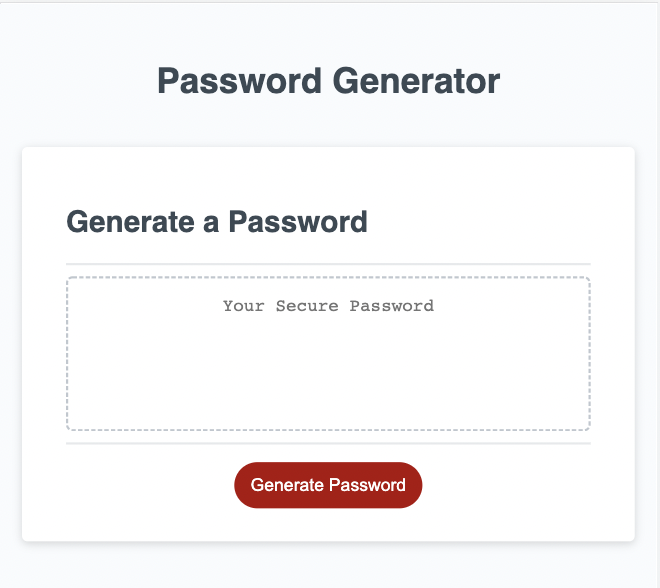
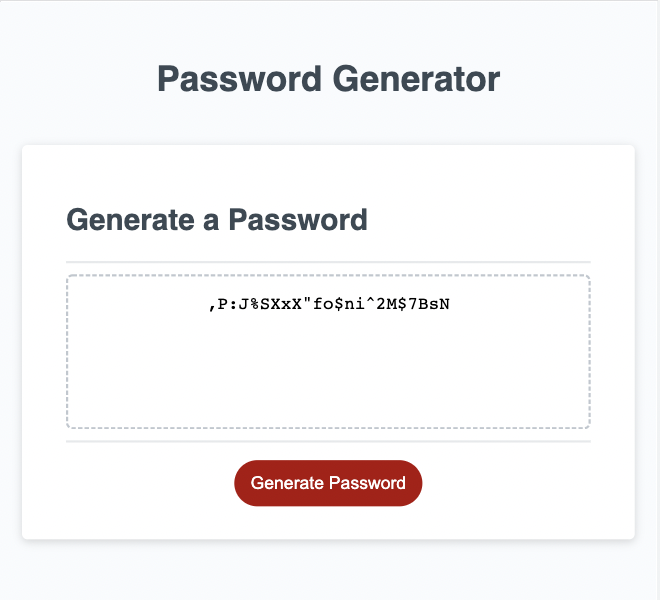

# Password Generator Starter Code

## Description

- The Random Password repository was created to add functionality to existing code (HTML, CSS and JavaScript) provided by the University of Toronto School of Continuing Studies Coding Bootcamp by adding JavaScript commands to create a random password generator that adapts to user inputted conditions.
- This project was created to strengthen my proficiency working with writing basic Javascript functions through application and practice, so that I may create functional and responsive web pages. 
- In just the click of a button, the Random Password webpage offers users an opportunity to outline certain conditions they would like included in their password, while still randomizing within those parameters through a series of prompts.  

### Page Preview

### Link to Application

[View in browser](https://katiebutler37.github.io/random-password/)

